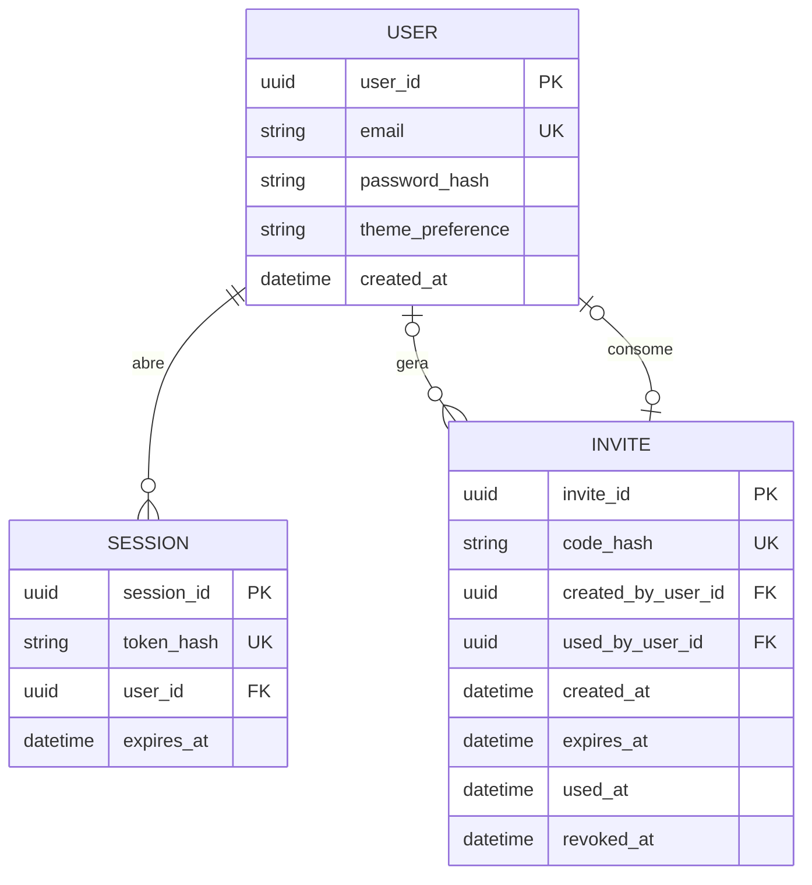

```mermaid
erDiagram
    USER {
        uuid user_id PK
        string email UK
        string password_hash
        string theme_preference
        datetime created_at
    }

    INVITE {
        uuid invite_id PK
        string code_hash UK
        uuid created_by_user_id FK
        uuid used_by_user_id FK
        datetime created_at
        datetime expires_at
        datetime used_at
        datetime revoked_at
    }

    SESSION {
        uuid session_id PK
        string token_hash UK
        uuid user_id FK
        datetime expires_at
    }

    USER ||--o{ SESSION : "abre"
    USER |o--o{ INVITE : "gera"
    USER |o--o| INVITE : "consome"
```
