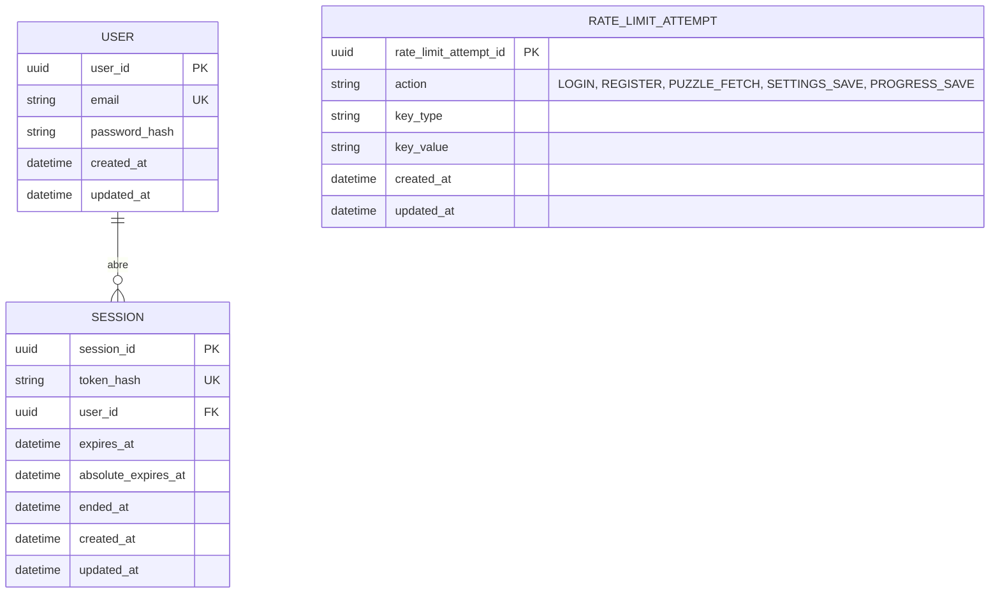

```mermaid
erDiagram
    USER {
        uuid user_id PK
        string email UK
        string password_hash
        datetime created_at
        datetime updated_at
    }

    SESSION {
        uuid session_id PK
        string token_hash UK
        uuid user_id FK
        datetime expires_at
        datetime absolute_expires_at
        datetime ended_at
        datetime created_at
        datetime updated_at
    }

    RATE_LIMIT_ATTEMPT {
        uuid rate_limit_attempt_id PK
        string action "LOGIN, REGISTER, PUZZLE_FETCH, SETTINGS_SAVE, PROGRESS_SAVE"
        string key_type
        string key_value
        datetime created_at
        datetime updated_at
    }

    USER ||--o{ SESSION : "abre"
```
