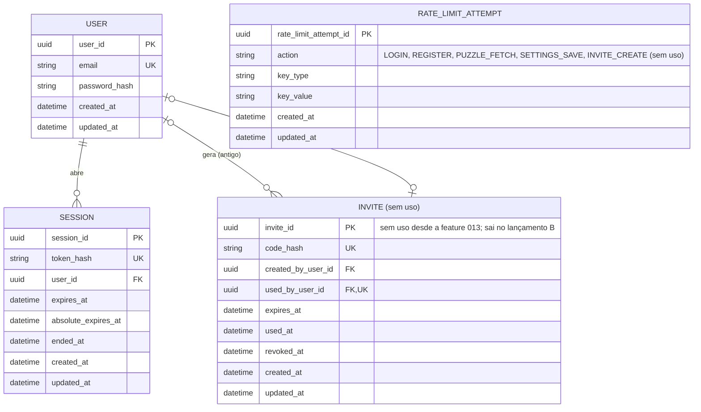

```mermaid
erDiagram
    USER {
        uuid user_id PK
        string email UK
        string password_hash
        datetime created_at
        datetime updated_at
    }

    SESSION {
        uuid session_id PK
        string token_hash UK
        uuid user_id FK
        datetime expires_at
        datetime absolute_expires_at
        datetime ended_at
        datetime created_at
        datetime updated_at
    }

    INVITE["INVITE (sem uso)"] {
        uuid invite_id PK "sem uso desde a feature 013; sai no lançamento B"
        string code_hash UK
        uuid created_by_user_id FK
        uuid used_by_user_id FK, UK
        datetime expires_at
        datetime used_at
        datetime revoked_at
        datetime created_at
        datetime updated_at
    }

    RATE_LIMIT_ATTEMPT {
        uuid rate_limit_attempt_id PK
        string action "LOGIN, REGISTER, PUZZLE_FETCH, SETTINGS_SAVE, INVITE_CREATE (sem uso)"
        string key_type
        string key_value
        datetime created_at
        datetime updated_at
    }

    USER ||--o{ SESSION : "abre"
    USER |o--o{ INVITE : "gera (antigo)"
    USER |o--o| INVITE : "consome (antigo)"
```
