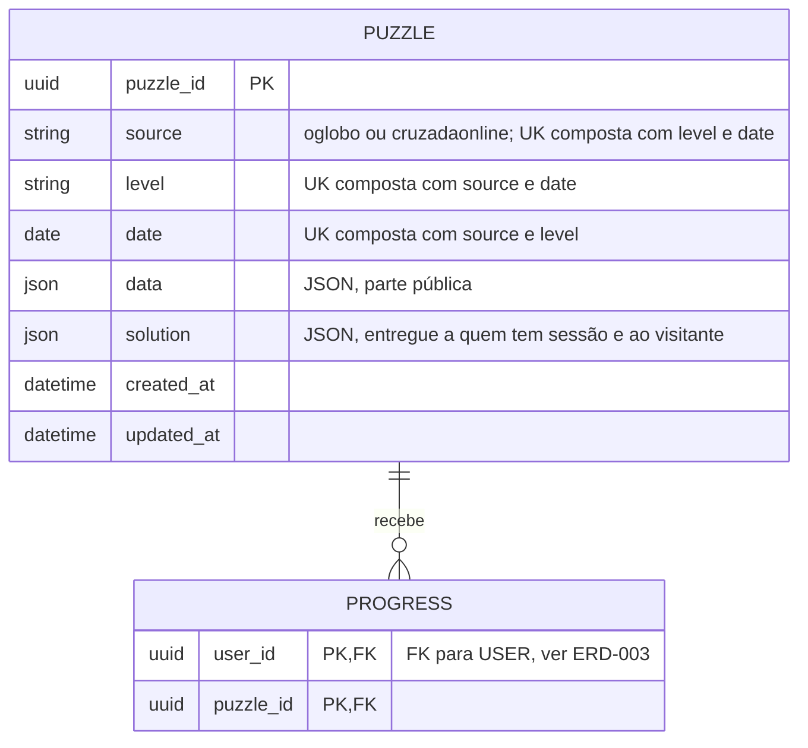

```mermaid
erDiagram
    PUZZLE {
        uuid puzzle_id PK
        string source "oglobo ou cruzadaonline; UK composta com level e date"
        string level "UK composta com source e date"
        date date "UK composta com source e level"
        json data "JSON, parte pública"
        json solution "JSON, entregue a quem tem sessão e ao visitante"
        datetime created_at
        datetime updated_at
    }

    PROGRESS {
        uuid user_id PK, FK "FK para USER, ver ERD-003"
        uuid puzzle_id PK, FK
    }

    PUZZLE ||--o{ PROGRESS : "recebe"
```
