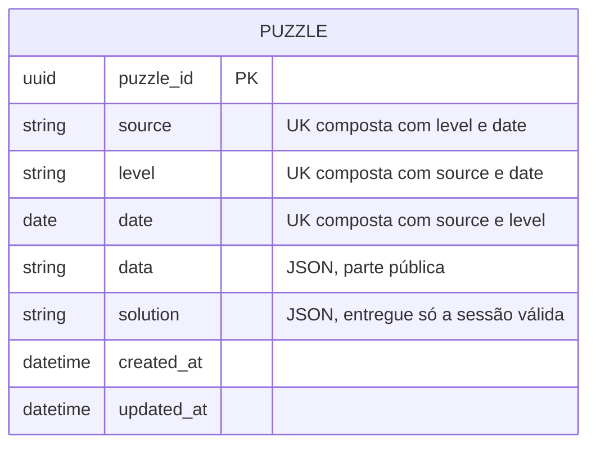

```mermaid
erDiagram
    PUZZLE {
        uuid puzzle_id PK
        string source "UK composta com level e date"
        string level "UK composta com source e date"
        date date "UK composta com source e level"
        string data "JSON, parte pública"
        string solution "JSON, entregue só a sessão válida"
        datetime created_at
        datetime updated_at
    }
```
