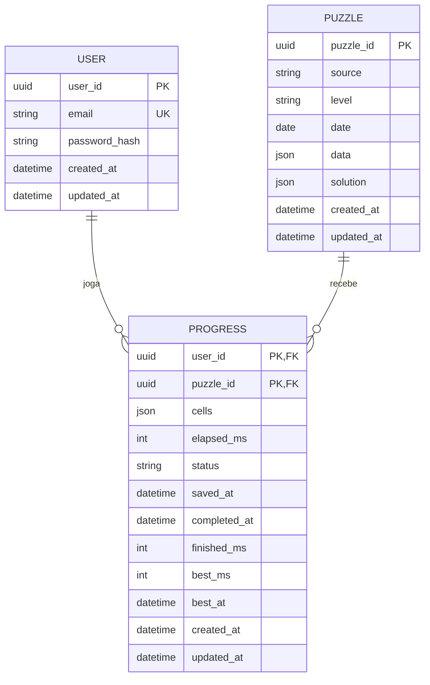

```mermaid
erDiagram
    USER {
        uuid user_id PK
        string email UK
        string password_hash
        datetime created_at
        datetime updated_at
    }

    PUZZLE {
        uuid puzzle_id PK
        string source
        string level
        date date
        json data
        json solution
        datetime created_at
        datetime updated_at
    }

    PROGRESS {
        uuid user_id PK, FK
        uuid puzzle_id PK, FK
        json cells
        int elapsed_ms
        string status
        datetime saved_at
        datetime completed_at
        int finished_ms
        int best_ms
        datetime best_at
        datetime created_at
        datetime updated_at
    }

    USER ||--o{ PROGRESS : "joga"
    PUZZLE ||--o{ PROGRESS : "recebe"
```
