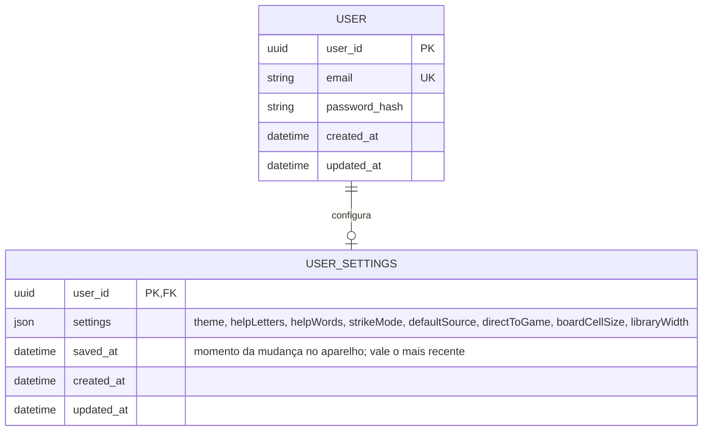

```mermaid
erDiagram
    USER {
        uuid user_id PK
        string email UK
        string password_hash
        datetime created_at
        datetime updated_at
    }

    USER_SETTINGS {
        uuid user_id PK, FK
        json settings "theme, helpLetters, helpWords, strikeMode, defaultSource, directToGame, boardCellSize, libraryWidth"
        datetime saved_at "momento da mudança no aparelho; vale o mais recente"
        datetime created_at
        datetime updated_at
    }

    USER ||--o| USER_SETTINGS : "configura"
```
