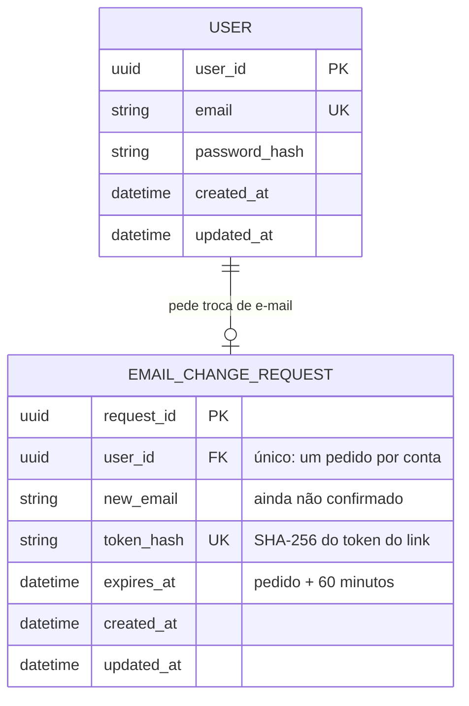

```mermaid
erDiagram
    USER {
        uuid user_id PK
        string email UK
        string password_hash
        datetime created_at
        datetime updated_at
    }

    EMAIL_CHANGE_REQUEST {
        uuid request_id PK
        uuid user_id FK "único: um pedido por conta"
        string new_email "ainda não confirmado"
        string token_hash UK "SHA-256 do token do link"
        datetime expires_at "pedido + 60 minutos"
        datetime created_at
        datetime updated_at
    }

    USER ||--o| EMAIL_CHANGE_REQUEST : "pede troca de e-mail"
```
