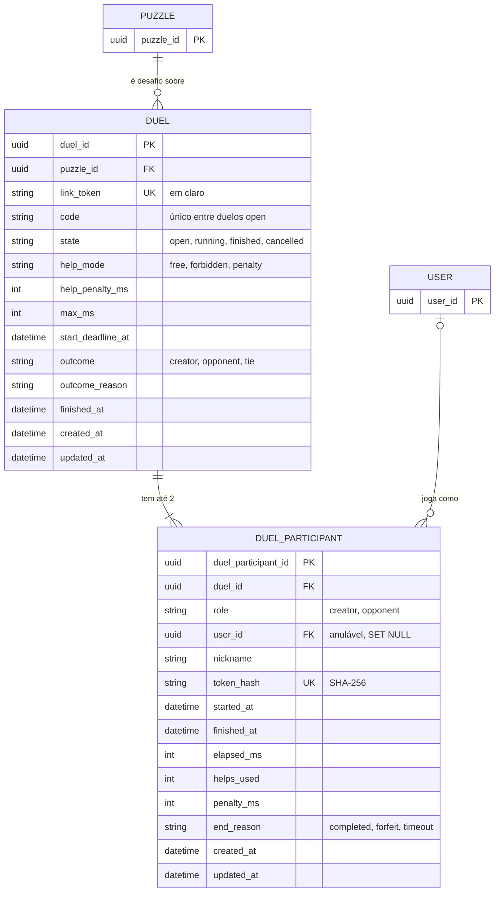

# ERD-007 — Duelos x1

Definições dos campos: [DDE-007](../data-definitions/DDE-007-duelos.md).

```mermaid
erDiagram
    USER {
        uuid user_id PK
    }

    PUZZLE {
        uuid puzzle_id PK
    }

    DUEL {
        uuid duel_id PK
        uuid puzzle_id FK
        string link_token UK "em claro"
        string code "único entre duelos open"
        string state "open, running, finished, cancelled"
        string help_mode "free, forbidden, penalty"
        int help_penalty_ms
        int max_ms
        datetime start_deadline_at
        string outcome "creator, opponent, tie"
        string outcome_reason
        datetime finished_at
        datetime created_at
        datetime updated_at
    }

    DUEL_PARTICIPANT {
        uuid duel_participant_id PK
        uuid duel_id FK
        string role "creator, opponent"
        uuid user_id FK "anulável, SET NULL"
        string nickname
        string token_hash UK "SHA-256"
        datetime started_at
        datetime finished_at
        int elapsed_ms
        int helps_used
        int penalty_ms
        string end_reason "completed, forfeit, timeout"
        datetime created_at
        datetime updated_at
    }

    PUZZLE ||--o{ DUEL : "é desafio sobre"
    DUEL ||--|{ DUEL_PARTICIPANT : "tem até 2"
    USER |o--o{ DUEL_PARTICIPANT : "joga como"
```
