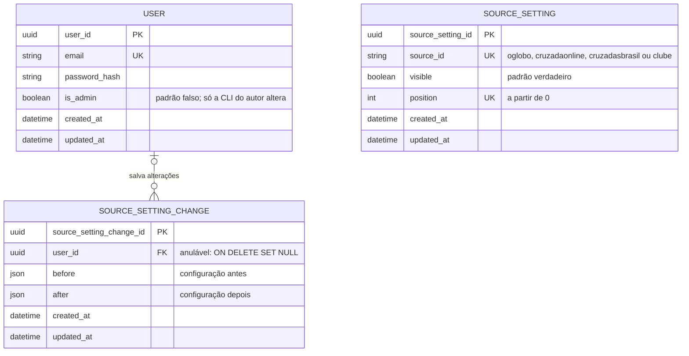

```mermaid
erDiagram
    USER {
        uuid user_id PK
        string email UK
        string password_hash
        boolean is_admin "padrão falso; só a CLI do autor altera"
        datetime created_at
        datetime updated_at
    }

    SOURCE_SETTING {
        uuid source_setting_id PK
        string source_id UK "oglobo, cruzadaonline, cruzadasbrasil ou clube"
        boolean visible "padrão verdadeiro"
        int position UK "a partir de 0"
        datetime created_at
        datetime updated_at
    }

    SOURCE_SETTING_CHANGE {
        uuid source_setting_change_id PK
        uuid user_id FK "anulável: ON DELETE SET NULL"
        json before "configuração antes"
        json after "configuração depois"
        datetime created_at
        datetime updated_at
    }

    USER |o--o{ SOURCE_SETTING_CHANGE : "salva alterações"
```
