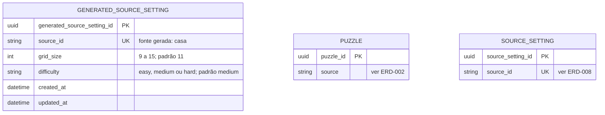

```mermaid
erDiagram
    GENERATED_SOURCE_SETTING {
        uuid generated_source_setting_id PK
        string source_id UK "fonte gerada: casa"
        int grid_size "9 a 15; padrão 11"
        string difficulty "easy, medium ou hard; padrão medium"
        datetime created_at
        datetime updated_at
    }

    PUZZLE {
        uuid puzzle_id PK
        string source "ver ERD-002"
    }

    SOURCE_SETTING {
        uuid source_setting_id PK
        string source_id UK "ver ERD-008"
    }
```

Sem chaves estrangeiras: `source_id` liga as três tabelas só pelo identificador de fonte do código.
